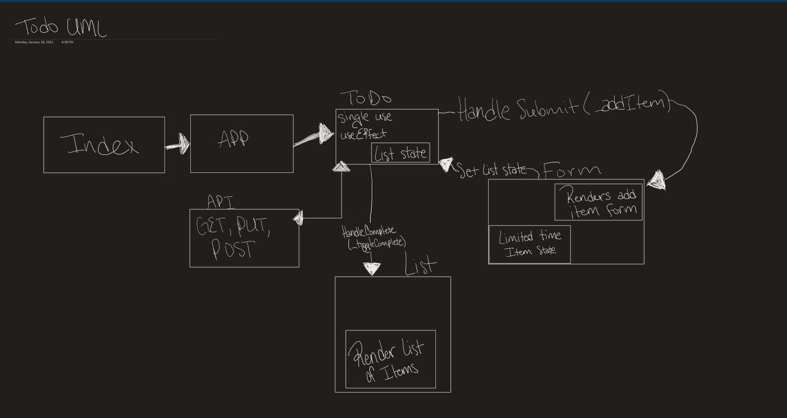

# ToDo

## LAB - Class 31

## Project: ToDo

### Author: Mariko Alvarado, Ricardo Barcenas, Simon Panek, Nathan Rhead

### Links and Resources

### Setup

#### `.env` requirements (where applicable)

N/A

#### How to initialize/run your application (where applicable)

- `npm start`

#### How to use your library (where applicable)

#### Tests

- How do you run tests?
- Any tests of note?
- Describe any tests that you did not complete, skipped, etc

#### UML

